# blessnet

Build distributed, scalable, edge based applications fast.

## getting started

Make sure you have `npm` installed. We recommend a `version 18+` the fastest way to getting started with npm is installing it into your system using `nvm`.

* <https://github.com/nvm-sh/nvm?tab=readme-ov-file#installing-and-updating>

Where ever you are, run `npx blessnet` to get context feedback. If calling from inside a project folder, information about the state of the project will be returned.

Otherwise the guided initializer will be called.

`npx blessnet help` will always provide more information.

### quick start

```bash
npx blessnet
```

* First launch you will be asked to install the `BLESS Runtime`.

```bash
➜ npx blessnet
BLESS environment not found. Do you want to install it? (yes/no): y
✔ Installation successful.
BLESS environment installed successfully.
You can now use the `blessnet` command.
```

## commands

| Command       | Description                             | Subcommands                          |
|---------------|-----------------------------------------|--------------------------------------|
| `init`        | Initialize a new project                | -                                    |
| `deploy`      | Deploy your project                     | -                                    |
| `build`       | Build the project                       | `--debug`                            |
| `wallet`      | Manage Solana wallets                   | `create`, `info`                     |
| `preview`     | Preview your project                    | `serve`                              |
| `manage`      | Manage your project                     | `type [newType]`                     |
| `account`     | Manage your account                     | `login`, `logout`                    |
| `registry`    | Register a worker node with your wallet | `stake`, `deactive`,`withdraw`,`info`|

## details

Create a new project with the name `foo`, the project will have a folder created called `foo`

```bash
npx blessnet init foo
cd foo
```

## Architecture

```mermaid
flowchart TD
    %% Top Layer: User Interface
    A["User Terminal (CLI)"]:::ui
    %% CLI Entry Point
    B["CLI Entry Point (index.js)"]:::entry
    A -->|"invokes"| B

    %% Middle Layer: Command Processing
    subgraph "Commands"
        C1["init.js — Project Initialization"]:::command
        C2["deploy.js — Handles Deployments"]:::command
        C3["build.js — Build Tool"]:::command
        C4["account.js — User Account Management"]:::command
        C5["wallet.js — Wallet Management"]:::command
        C6["createWallet.js — Create Wallet"]:::command
        C7["listWallets.js — List Wallets"]:::command
        C8["manage.js — Application Management"]:::command
        C9["preview.js — Deployment Preview"]:::command
        C10["walletInfo.js — Wallet Information"]:::command
    end
    B -->|"routes command"| C1
    B -->|"routes command"| C2
    B -->|"routes command"| C3
    B -->|"routes command"| C4
    B -->|"routes command"| C5
    B -->|"routes command"| C6
    B -->|"routes command"| C7
    B -->|"routes command"| C8
    B -->|"routes command"| C9
    B -->|"routes command"| C10

    %% Lower Layer: Utility Libraries
    subgraph "Utility Libraries"
        D1["config.js — Configuration Management"]:::lib
        D2["file-utils.js — File Operations"]:::lib
        D3["manifest.js — Manifest Handling"]:::lib
        D4["git.js — Git Operations"]:::lib
        D5["invoke.js — Deployment Invocation"]:::lib
        D6["npm.js — npm Interactions"]:::lib
        D7["server.js — Server Communication"]:::lib
    end

    %% Integration from Commands to Libraries
    C1 -->|"uses"| D1
    C1 -->|"uses"| D2
    C2 -->|"uses"| D5
    C2 -->|"uses"| D7
    C3 -->|"uses"| D2
    C4 -->|"uses"| D1
    C5 -->|"uses"| D6
    C5 -->|"integrates"| D1
    C6 -->|"uses"| D1
    C7 -->|"uses"| D2
    C8 -->|"uses"| D3
    C9 -->|"uses"| D7
    C10 -->|"uses"| D1

    %% External Services
    E1["npm/npx"]:::external
    E2["Solana Network"]:::external
    D6 -->|"triggers"| E1
    C2 -->|"invokes"| E1
    C5 -->|"integrates"| E2

    %% CI/CD & Testing
    subgraph "CI/CD & Testing"
        F1["GitHub Workflows (npm.yml)"]:::ci
        F2["Test Suite (invoke.test.js)"]:::ci
    end
    B -->|"CI integration"| F1
    F1 -->|"triggers tests"| F2

    %% Example Assets
    G["Example Asset (hello_test.wasm)"]:::asset

    %% Styles & Classes
    classDef ui fill:#f9f,stroke:#333,stroke-width:2px;
    classDef entry fill:#ccf,stroke:#333,stroke-width:2px;
    classDef command fill:#cfc,stroke:#333,stroke-width:2px;
    classDef lib fill:#fcf,stroke:#333,stroke-width:2px;
    classDef external fill:#cff,stroke:#333,stroke-width:2px;
    classDef ci fill:#ffc,stroke:#333,stroke-width:2px;
    classDef asset fill:#efe,stroke:#333,stroke-width:2px;

    %% Click Events for CLI Entry Point
    click B "https://github.com/blessnetwork/blessnet/blob/main/index.js"

    %% Click Events for Command Modules
    click C1 "https://github.com/blessnetwork/blessnet/blob/main/commands/init.js"
    click C2 "https://github.com/blessnetwork/blessnet/blob/main/commands/deploy.js"
    click C3 "https://github.com/blessnetwork/blessnet/blob/main/commands/build.js"
    click C4 "https://github.com/blessnetwork/blessnet/blob/main/commands/account.js"
    click C5 "https://github.com/blessnetwork/blessnet/blob/main/commands/wallet.js"
    click C6 "https://github.com/blessnetwork/blessnet/blob/main/commands/createWallet.js"
    click C7 "https://github.com/blessnetwork/blessnet/blob/main/commands/listWallets.js"
    click C8 "https://github.com/blessnetwork/blessnet/blob/main/commands/manage.js"
    click C9 "https://github.com/blessnetwork/blessnet/blob/main/commands/preview.js"
    click C10 "https://github.com/blessnetwork/blessnet/blob/main/commands/walletInfo.js"

    %% Click Events for Utility Libraries
    click D1 "https://github.com/blessnetwork/blessnet/blob/main/lib/config.js"
    click D2 "https://github.com/blessnetwork/blessnet/blob/main/lib/file-utils.js"
    click D3 "https://github.com/blessnetwork/blessnet/blob/main/lib/manifest.js"
    click D4 "https://github.com/blessnetwork/blessnet/blob/main/lib/git.js"
    click D5 "https://github.com/blessnetwork/blessnet/blob/main/lib/invoke.js"
    click D6 "https://github.com/blessnetwork/blessnet/blob/main/lib/npm.js"
    click D7 "https://github.com/blessnetwork/blessnet/blob/main/lib/server.js"

    %% Click Events for CI/CD & Testing
    click F1 "https://github.com/blessnetwork/blessnet/blob/main/.github/workflows/npm.yml"
    click F2 "https://github.com/blessnetwork/blessnet/blob/main/test/invoke.test.js"

    %% Click Event for Example Assets
    click G "https://github.com/blessnetwork/blessnet/blob/main/fixtures/hello_test.wasm"
```



### project structure

```text
.
├── bls.toml              # project config
├── index.ts              # entry
├── package.json          # javascript packages
├── tsconfig.base.json    # typescript configs
├── tsconfig.debug.json   # typescript configs
└── tsconfig.release.json # typescript configs
```

### deploy

To deploy the application, cd into the directory and run

```bash
npx blessnet deploy
```

### deploy keys

**WARN**

## other things

Install `blessnet` globally for use without npx.

```bash
npm i -g blessnet
```

```bash
npx blessnet wallet list
```
